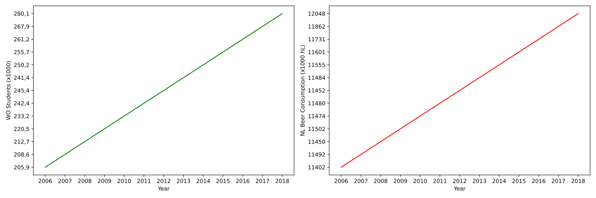

## Full papers:

- Fantastic yeasts and where to find them: the hidden diversity of dimorphic fungal pathogens (MCC Van Dyke et al., 2019)
(Could also be "The Rise of Coccidioides: Forces Against the Dust Devil Unleashed")
- An analysis of the forces required to drag sheep over various surfaces (JT Harvey, Applied Ergonomics, 2002)
- The neurocognitive effects of alcohol on adolescents and college students (DW Ziegler et al., 2005)

## Plot:

Here is a plot of both the increase in students over the years, and the increase in beer consumption over those same years.

I decided to use 2 separate subplots, because using 2 y-axes on the same figure is a bit unclear sometimes. (And the lines would perfectly overlap.)

Some notes about the data: we clearly see an increase in both graphs and it seems like there is perfect correlation, but this is just because of the scaling of the figure.
Doing some arithmetic, we arrive at the conclusion that if there were perfect correlation, on average each student would need to drink about 9.5 glasses of beer per day, which I can say from personal experience is definitely the case. Conclusion: The increase in beer consumption is purely due to the increase in WO students.

(Kidding.)